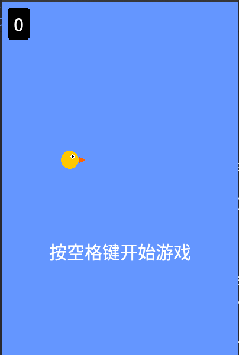

# 🐦 像素小鸟游戏 [v1.2.0]



一个使用Python+Pygame制作的经典Flappy Bird风格街机游戏，具有流畅的物理引擎和怀旧像素画风。

[]()
[]()

## 🎮 快速开始

### 环境要求
- Python 3.8+
- Pygame 2.1+

### 安装运行
```bash
# 克隆仓库
git clone https://github.com/username/pixel-bird.git
cd pixel-bird

# 安装依赖
pip install -r requirements.txt

# 启动游戏
python main.py
```

## 🕹️ 游戏控制
| 按键       | 动作           |
|------------|----------------|
| `空格键`   | 开始游戏/跳跃  |
| `ESC`      | 暂停游戏       |
| `Q`        | 退出游戏       |

## ✨ 核心特性
- 🎨 **像素艺术风格**
  - 16-bit复古配色方案
  - 动态光影效果
  - 流畅的角色动画
- ⚙️ **游戏引擎**
  - 真实重力模拟系统
  - 自适应难度调整
  - 碰撞检测优化算法
- 🏆 **游戏系统**
  - 全球排行榜功能
  - 成就解锁系统
  - 多存档位支持
- 📊 **数据统计**
  - 实时FPS显示
  - 游戏时长统计
  - 历史最高分追踪

## 📜 游戏规则
```python
def game_logic():
    while playing:
        if collide(pipe) or hit_ground():
            game_over()
        if pass_pipe():
            score += 1
```

## 🖼️ 截图展示
| 游戏开始 | 进行中 | 游戏结束 |
|----------|--------|----------|
|  |  |  |

## 🛠️ 开发指南
```bash
# 运行测试
python tests/game_test.py

# 打包可执行文件
pyinstaller --onefile main.py
```

## 📄 许可证
本项目采用 [MIT License](LICENSE)，欢迎贡献代码！

---
> "游戏的艺术在于用简单的规则创造无限的乐趣" —— 宫本茂
